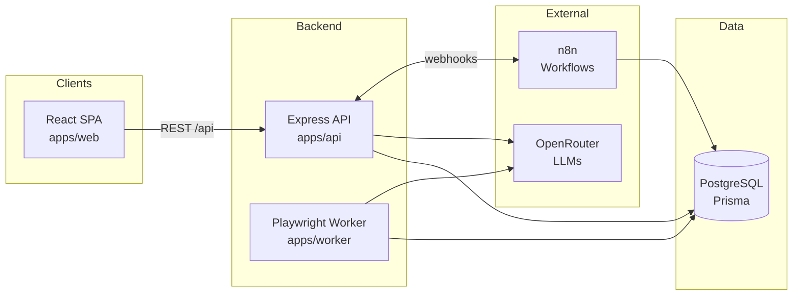

# OmniStacks AI Engine

Production-ready architecture for an AI-powered **lead generation platform**: scrape and
import leads, enrich and score them with LLMs (via OpenRouter), and automate outreach with
n8n workflows.

> **Status:** infrastructure scaffold. The architecture, tooling, and deployment story are
> in place — business logic (scrapers, enrichment, scoring, outreach) is intentionally not
> implemented yet.

## Documentation

The [`docs/`](docs) directory is the project's single source of truth:

| Document                                        | Contents                                                                            |
| ----------------------------------------------- | ----------------------------------------------------------------------------------- |
| [ARCHITECTURE.md](docs/ARCHITECTURE.md)         | System architecture, service responsibilities, data flow, design decisions, scaling |
| [ROADMAP.md](docs/ROADMAP.md)                   | Milestones with independently testable completion criteria                          |
| [DATABASE.md](docs/DATABASE.md)                 | Tables, relationships, indexes, naming conventions, migrations                      |
| [API.md](docs/API.md)                           | REST conventions, errors, validation, auth, versioning                              |
| [CODING_STANDARDS.md](docs/CODING_STANDARDS.md) | TypeScript conventions, naming, logging, errors, testing                            |
| [PROMPTS.md](docs/PROMPTS.md)                   | All AI prompts, their purpose, and JSON response schemas                            |
| [N8N.md](docs/N8N.md)                           | Planned workflows, triggers, queues, retry logic                                    |
| [DEPLOYMENT.md](docs/DEPLOYMENT.md)             | Local dev, Docker, production, env vars, backups                                    |

## Stack

| Layer           | Technology                                  |
| --------------- | ------------------------------------------- |
| Frontend        | React 19 + Vite + TypeScript (`apps/web`)   |
| API             | Node.js + Express + TypeScript (`apps/api`) |
| Database        | PostgreSQL 16 + Prisma ORM                  |
| Jobs / Scraping | Playwright worker (`apps/worker`)           |
| LLM gateway     | OpenRouter                                  |
| Automation      | n8n (self-hosted, Postgres-backed)          |
| Packaging       | Docker + Docker Compose                     |
| CI              | GitHub Actions                              |

## Architecture



- **apps/web** — React SPA. Talks to the API through `src/api/client.ts` (proxied under `/api`).
- **apps/api** — Express REST API. Owns the Prisma schema, validates env with Zod, exposes
  `/api/health` (liveness + readiness), and hosts the OpenRouter client.
- **apps/worker** — long-running process for background jobs (Playwright scraping, LLM
  enrichment). Picks up `ScrapeJob` rows written by the API.
- **n8n** — workflow automation for outreach sequences, CRM syncs, and webhook integrations.
  Exported workflow JSON is versioned in [`n8n/workflows/`](n8n/README.md).

## Project structure

```
.
├── apps/
│   ├── api/                  # Express + Prisma REST API
│   │   ├── prisma/           # schema.prisma + migrations
│   │   └── src/
│   │       ├── config/       # env parsing/validation (Zod)
│   │       ├── lib/          # prisma client, openrouter client
│   │       ├── middleware/   # error handling, ...
│   │       ├── modules/      # feature modules (business logic goes here)
│   │       └── routes/       # route composition (health, ...)
│   ├── web/                  # React + Vite SPA
│   │   └── src/
│   │       ├── api/          # typed fetch client
│   │       ├── components/   # shared UI
│   │       ├── pages/        # feature pages
│   │       └── styles/
│   └── worker/               # Playwright job worker
│       └── src/
│           ├── config/       # env parsing/validation
│           └── jobs/         # job handlers (business logic goes here)
├── docker/                   # Dockerfiles, nginx config, postgres init
├── n8n/workflows/            # exported n8n workflow JSON (versioned)
├── scripts/                  # setup / dev / db helper scripts
├── .github/workflows/        # CI (typecheck, build, docker images)
└── docker-compose.yml        # postgres, api, web, worker, n8n
```

## Getting started

### Prerequisites

- Node.js ≥ 20 (see `.nvmrc`), npm ≥ 10
- Docker + Docker Compose

### Local development

```bash
# 1. Install deps, create .env, generate the Prisma client
./scripts/setup.sh

# 2. Edit .env (at minimum: OPENROUTER_API_KEY, JWT_SECRET, N8N_ENCRYPTION_KEY)

# 3. Start Postgres + n8n in Docker, run migrations, launch all apps in watch mode
./scripts/dev.sh
```

| Service  | URL                       |
| -------- | ------------------------- |
| Web      | http://localhost:5173     |
| API      | http://localhost:4000/api |
| n8n      | http://localhost:5678     |
| Postgres | localhost:5432            |

### Full stack in Docker

```bash
cp .env.example .env   # then fill in secrets
docker compose up -d --build
```

The API container applies Prisma migrations automatically on boot
(`docker/api/entrypoint.sh`). The web app is served by nginx on
http://localhost:8080 with `/api` proxied to the API container.

## Environment variables

All configuration is documented in [`.env.example`](.env.example). Highlights:

| Variable             | Purpose                              |
| -------------------- | ------------------------------------ |
| `DATABASE_URL`       | Prisma connection string             |
| `API_PORT`           | API listen port (default `4000`)     |
| `OPENROUTER_API_KEY` | OpenRouter API key for LLM calls     |
| `OPENROUTER_MODEL`   | Default model for enrichment/scoring |
| `JWT_SECRET`         | Auth token signing secret            |
| `N8N_ENCRYPTION_KEY` | Encrypts credentials stored by n8n   |
| `WORKER_CONCURRENCY` | Parallel jobs per worker instance    |

Env vars are validated at startup with Zod (`apps/*/src/config/env.ts`) — the process
fails fast with a clear error if configuration is missing or malformed.

## Scripts

| Command                        | Description                                       |
| ------------------------------ | ------------------------------------------------- |
| `./scripts/setup.sh`           | One-time setup (env file, deps, Prisma client)    |
| `./scripts/dev.sh`             | Start infra in Docker + all apps in watch mode    |
| `./scripts/db-migrate.sh name` | Create/apply a development migration              |
| `./scripts/db-reset.sh`        | Wipe and rebuild the local database (destructive) |
| `npm run dev`                  | Run api + web + worker concurrently (watch mode)  |
| `npm run build`                | Build all workspaces                              |
| `npm run typecheck`            | Typecheck all workspaces                          |
| `npm run format` / `:check`    | Prettier write / check                            |
| `npm run prisma:studio`        | Open Prisma Studio                                |

## Continuous integration

`.github/workflows/ci.yml` runs on every PR and push to `main`:

1. **Quality** — `npm ci`, Prisma schema validation + client generation, Prettier check,
   TypeScript typecheck, and full build of all workspaces.
2. **Docker** — builds the `api`, `web`, and `worker` images (matrix) with GitHub Actions
   layer caching.

## Database

The Prisma schema (`apps/api/prisma/schema.prisma`) models the platform's core entities:

- **User** — platform users (`ADMIN` / `MEMBER`)
- **Campaign** — a lead generation campaign owned by a user
- **Lead** — a prospect within a campaign (source, status, score, enrichment JSON)
- **ScrapeJob** — background job queue rows consumed by the worker
  (`SCRAPE` / `ENRICH` / `SCORE` / `SYNC`)

Create the first migration once Postgres is running: `./scripts/db-migrate.sh init`.
