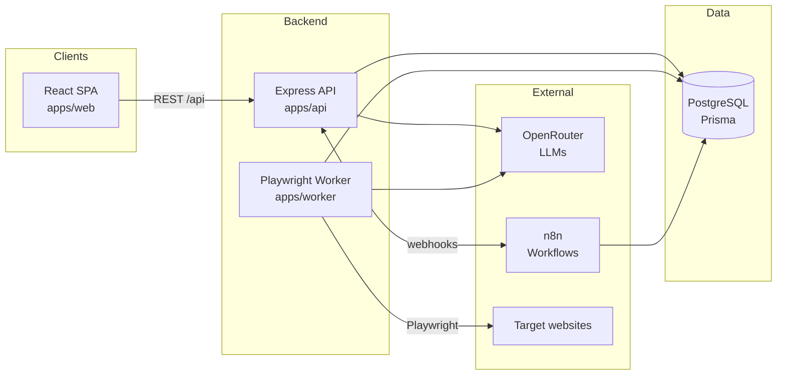

# Architecture

Single source of truth for how OmniStacks AI Engine is put together. If code and this
document disagree, fix one of them in the same PR.

## System overview

OmniStacks AI Engine is an AI-powered lead generation platform: it scrapes and imports
prospects, enriches and scores them with LLMs (via OpenRouter), and automates outreach
through n8n workflows.



## Service responsibilities

| Service        | Location           | Responsibilities                                                                                                                                                                                                                                                                                                                                                                                                                                              | Explicitly NOT responsible for                                                                     |
| -------------- | ------------------ | ------------------------------------------------------------------------------------------------------------------------------------------------------------------------------------------------------------------------------------------------------------------------------------------------------------------------------------------------------------------------------------------------------------------------------------------------------------- | -------------------------------------------------------------------------------------------------- |
| **Web**        | `apps/web`         | UI for campaigns, leads, workflows, settings. All data access through `src/api/client.ts`.                                                                                                                                                                                                                                                                                                                                                                    | Talking to the database, OpenRouter, or n8n directly.                                              |
| **API**        | `apps/api`         | REST endpoints, request validation (Zod), authentication/authorization, owning the Prisma schema, enqueueing `ScrapeJob` rows, the website analyzer module (Playwright-driven data collection, see below), the business-audit module (OpenRouter-driven fit scoring, see below), the email-draft module (OpenRouter-driven outreach drafting, see below), triggering n8n via `lib/n8n-client.ts`, and the `webhooks` module receiving n8n's status callbacks. | Long-running work needing durable multi-instance queueing (moves to `apps/worker` once M6 exists). |
| **Worker**     | `apps/worker`      | Polling `ScrapeJob` rows, Playwright scraping, batch LLM enrichment/scoring, persisting results, updating job status/attempts.                                                                                                                                                                                                                                                                                                                                | Serving HTTP; defining schema (consumes API's Prisma schema).                                      |
| **PostgreSQL** | Compose `postgres` | System of record for application data (`omnistacks` DB) and n8n state (`n8n` DB, created by `docker/postgres/init/01-create-n8n-db.sh`).                                                                                                                                                                                                                                                                                                                      | —                                                                                                  |
| **n8n**        | Compose `n8n`      | Sending outreach email via the operator's own Gmail/SMTP credential, classifying replies. Workflow JSON is versioned in `n8n/workflows/` (see [N8N.md](N8N.md)).                                                                                                                                                                                                                                                                                              | Core data mutations (goes through the API's webhook endpoints, never the database directly).       |

## Data flow

The canonical lead lifecycle:

1. **Campaign created** — user creates a `Campaign` via the API (`DRAFT` → `ACTIVE`).
2. **Job enqueued** — API inserts a `ScrapeJob` (`type=SCRAPE`, `status=PENDING`) with the
   target criteria in `payload`.
3. **Scraping** — worker claims the job (`PENDING` → `RUNNING`), launches Chromium via
   `src/browser.ts`, extracts prospects, and inserts `Lead` rows (`source=SCRAPED`,
   `status=NEW`).
4. **Enrichment** — an `ENRICH` job sends lead context to OpenRouter using the prompts in
   [PROMPTS.md](PROMPTS.md); the validated JSON result is stored in `Lead.enrichment`
   (`status=ENRICHED`).
5. **Scoring** — a `SCORE` job produces `Lead.score` (0–100) and qualification
   (`status=QUALIFIED` / `DISQUALIFIED`).
6. **Outreach** — the API calls an n8n webhook; n8n runs the outreach sequence and reports
   back via API webhooks (`status=CONTACTED` → `CONVERTED`).

Every state transition is persisted in PostgreSQL — the database is the only shared state
between services (no in-memory coordination).

> This numbered list describes the scaffold's original `Campaign`/`Lead` design; those
> models are superseded by `Business` as the operative entity (see
> [DATABASE.md](DATABASE.md) and [ROADMAP.md](ROADMAP.md)). The flow actually implemented
> so far is the website analyzer, below.

### Website analysis flow (implemented, M2)

1. **Business created** — via the lead management API (`status=NEW`).
2. **Analysis started** — `POST /api/businesses/:businessId/website-analyses` validates
   the business has a website, creates a `WebsiteAnalysis` row (`status=PENDING`), and
   returns immediately (`202`). Execution continues in the background, gated by a small
   in-process concurrency limiter (not the durable queue scoped for M6).
3. **Capture** — the analyzer marks the row `RUNNING`, launches Chromium (Playwright,
   in-process within `apps/api` — see the design decision below), navigates to the site
   (tolerating redirects, invalid TLS certs, and bounded timeouts), and extracts a full
   page's worth of structured data plus a full-page screenshot.
4. **Persisted** — all captured fields, the screenshot (saved to local disk, metadata in
   the row), and `durationMs` are written; status becomes `COMPLETED` or, on failure,
   `FAILED` with an `error` message.
5. **Business promoted** — on success, the business transitions `NEW → ANALYZED`
   (idempotent: a no-op if it's already past `NEW`).

Every state transition is persisted in PostgreSQL, same as the pattern above — the
analyzer introduces no new shared-state mechanism.

### Business audit flow (implemented, M3)

1. **Audit started** — `POST /api/businesses/:businessId/audits` validates the business
   has a `COMPLETED` website analysis (`422` if not), creates a `BusinessAudit` row
   (`status=PENDING`), and returns immediately (`202`). Execution continues in the
   background, gated by the same `ConcurrencyLimiter` primitive the website analyzer
   uses (`apps/api/src/lib/concurrency-limiter.ts`, shared rather than duplicated once a
   second module needed it).
2. **Prompt built** — the audit marks the row `RUNNING`, and `modules/business-audit/prompt.ts`
   builds the `business-audit-v1` messages (see [PROMPTS.md](PROMPTS.md)) from the
   business, its latest completed analysis (trimmed to the fields relevant to scoring),
   and the operator-wide `BUSINESS_CONTEXT` env var describing the ideal customer profile.
3. **LLM call + validation** — `lib/openrouter.ts` calls the configured model; the JSON
   response is Zod-validated against `auditResponseSchema`. On a parse or validation
   failure, the error is appended to the conversation and retried once; a second failure
   marks the audit `FAILED` and never persists unvalidated output.
4. **Persisted** — summary, findings, score, confidence, reasons, disqualifiers, model,
   token counts, and `durationMs` are written; status becomes `COMPLETED` or, on failure,
   `FAILED` with an `error` message.
5. **Business updated** — on success, `businesses.score` is always overwritten with the
   new score, and `businesses.status` is promoted `ANALYZED → AUDITED` only if it is
   still exactly `ANALYZED` (idempotent past that point, so re-auditing a business that
   has already moved further down the pipeline never regresses it).

Every state transition is persisted in PostgreSQL, same as the pattern above — the
audit module introduces no new shared-state mechanism.

### Outreach flow (implemented, M4)

1. **Draft started** — `POST /api/businesses/:businessId/email-drafts` validates the
   business has a `COMPLETED` audit (`422` if not), creates an `EmailDraft` row
   (`status=PENDING`), and returns immediately (`202`). Execution continues in the
   background, gated by its own `ConcurrencyLimiter` instance (same shared primitive,
   separate concurrency budget via `EMAIL_DRAFT_MAX_CONCURRENCY`).
2. **Prompt built** — `modules/email-draft/prompt.ts` builds the `email-personalization-v1`
   messages (see [PROMPTS.md](PROMPTS.md)) from the business, a trimmed summary of its
   latest completed audit, and the same `BUSINESS_CONTEXT` env var `business-audit-v1`
   uses.
3. **LLM call + validation** — same shared retry-once-then-fail helper business-audit
   uses (`lib/llm-json.ts`, extracted once a second module needed identical retry logic).
   Only `subject`/`opener`/`factUsed` come from the model; the full email `body` is
   assembled in code by substituting the opener into the operator's
   `OUTREACH_EMAIL_TEMPLATE` — the template itself is never model-generated.
4. **Persisted** — subject, opener, factUsed, the assembled body, model, token counts, and
   `durationMs` are written; status becomes `COMPLETED` or, on failure, `FAILED`.
5. **Business updated** — on success, `businesses.status` is promoted `AUDITED →
EMAIL_DRAFTED` (idempotent, same equality-check pattern as the audit flow).
6. **Send triggered** — a separate, explicit `POST /api/email-drafts/:id/send` (operator
   action, not automatic) fires `lib/n8n-client.ts`'s fire-and-forget call to n8n's
   `outreach-send` webhook (workflow 01, see [N8N.md](N8N.md)). A failed trigger is
   reported back as `triggered: false` rather than an HTTP error or a stored `FAILED`
   state — the draft simply stays unsent and can be retried.
7. **Delivery confirmed** — n8n sends the email via the operator's own Gmail/SMTP
   credential, then calls back `POST /api/webhooks/email-sent` (shared-secret
   authenticated). The `webhooks` module sets `EmailDraft.sentAt` (once) and advances
   `businesses.status` to `EMAIL_SENT` via the monotonic `advanceStatus()` helper (see
   below) rather than a simple equality check, since webhook delivery can be delayed or
   retried.
8. **Reply handled** — n8n's `reply-handler` workflow (02) polls the operator's inbox,
   classifies replies, and calls back `POST /api/webhooks/email-reply`, advancing
   `businesses.status` to `RESPONDED` or `MEETING_BOOKED` (the latter reachable directly,
   skipping `RESPONDED`, if the reply asks for a meeting outright).

Every state transition is persisted in PostgreSQL, same as the pattern above — steps 1–5
introduce no new shared-state mechanism; steps 6–8 are the first place n8n and its
shared-secret webhook contract enter the picture (see [N8N.md](N8N.md)).

## Folder structure

```
.
├── apps/
│   ├── api/                  # Express + Prisma REST API
│   │   ├── prisma/           # schema.prisma + migrations (owned here)
│   │   └── src/
│   │       ├── config/       # env parsing/validation (Zod)
│   │       ├── lib/          # prisma client, openrouter client, concurrency limiter,
│   │       │                 # shared LLM JSON-retry helper, n8n client
│   │       ├── middleware/   # error handling, auth (future)
│   │       ├── modules/      # feature modules (business logic goes here)
│   │       │   ├── businesses/        # lead management (M1)
│   │       │   ├── website-analyzer/  # Playwright data collection (M2)
│   │       │   │   └── extract/       # pure classification/extraction helpers
│   │       │   ├── business-audit/    # OpenRouter fit scoring (M3)
│   │       │   ├── email-draft/       # OpenRouter outreach drafting (M4)
│   │       │   └── webhooks/          # n8n callback endpoints (M4)
│   │       └── routes/       # route composition (health, ...)
│   ├── web/                  # React + Vite SPA
│   │   └── src/
│   │       ├── api/          # typed fetch client
│   │       ├── components/   # shared UI
│   │       ├── pages/        # feature pages
│   │       └── styles/
│   └── worker/               # Playwright job worker
│       └── src/
│           ├── config/       # env parsing/validation
│           └── jobs/         # job handlers (business logic goes here)
├── docker/                   # Dockerfiles, nginx config, postgres init
├── docs/                     # this documentation
├── n8n/workflows/            # exported n8n workflow JSON (versioned)
├── scripts/                  # setup / dev / db helper scripts
├── .github/workflows/        # CI
└── docker-compose.yml        # postgres, api, web, worker, n8n
```

Feature code lands in `apps/api/src/modules/<feature>/` (routes + services per feature)
and `apps/worker/src/jobs/<job-type>.ts` — see
[CODING_STANDARDS.md](CODING_STANDARDS.md).

## Design decisions

| Decision                                                                                                                           | Rationale                                                                                                                                                                                                                                                                                                                                         |
| ---------------------------------------------------------------------------------------------------------------------------------- | ------------------------------------------------------------------------------------------------------------------------------------------------------------------------------------------------------------------------------------------------------------------------------------------------------------------------------------------------- |
| **Monorepo with npm workspaces**                                                                                                   | One repo, one lockfile, one CI pipeline; no tooling beyond npm. Apps stay independently buildable/deployable (separate Dockerfiles).                                                                                                                                                                                                              |
| **Separate worker process**                                                                                                        | Scraping and LLM batch work are long-running and crash-prone; isolating them keeps the API responsive and lets workers scale/restart independently.                                                                                                                                                                                               |
| **Job queue in PostgreSQL (`scrape_jobs`)**                                                                                        | At current scale a table + polling is simpler and fully transactional with the data it produces. No extra infra. Revisit at scale (see below).                                                                                                                                                                                                    |
| **Prisma as ORM**                                                                                                                  | Schema-as-code, generated types shared with TypeScript, mature migration tooling (`migrate dev`/`migrate deploy`).                                                                                                                                                                                                                                |
| **OpenRouter instead of direct provider SDKs**                                                                                     | One API for many models; model choice is an env var (`OPENROUTER_MODEL`), so swapping models is config, not code.                                                                                                                                                                                                                                 |
| **Thin hand-rolled OpenRouter client**                                                                                             | The OpenAI-compatible surface we use is one endpoint; a fetch wrapper avoids an SDK dependency and keeps the request shape explicit.                                                                                                                                                                                                              |
| **n8n for outreach/integrations**                                                                                                  | Non-developers can own outreach sequences; integrations (CRMs, email tools) come for free; workflow JSON is still code-reviewed in `n8n/workflows/`.                                                                                                                                                                                              |
| **n8n gets its own database**                                                                                                      | Keeps n8n's internal tables out of the application schema; both live on the same Postgres instance for operational simplicity.                                                                                                                                                                                                                    |
| **nginx serves the SPA and proxies `/api`**                                                                                        | Same-origin in production (no CORS headaches), immutable asset caching, one public entrypoint for the web tier.                                                                                                                                                                                                                                   |
| **ESM everywhere, strict TS base config**                                                                                          | Single module system across apps; `tsconfig.base.json` enforces strictness uniformly.                                                                                                                                                                                                                                                             |
| **Zod-validated env at startup**                                                                                                   | Misconfiguration fails fast at boot with a precise error instead of surfacing mid-request.                                                                                                                                                                                                                                                        |
| **Migrations applied by the API container**                                                                                        | `docker/api/entrypoint.sh` runs `prisma migrate deploy` on boot — deploys are self-contained; no manual migration step.                                                                                                                                                                                                                           |
| **Website analyzer runs in-process inside `apps/api`, not `apps/worker`**                                                          | The durable job queue (M6) isn't built yet, and this module's job is explicitly scoped to data collection only; adding cross-process dispatch now would be new infrastructure the milestone doesn't need. A small in-process concurrency limiter (not a queue) caps simultaneous Playwright launches. Revisit once M6 exists or load requires it. |
| **`docker/api.Dockerfile` now built on the Playwright base image**                                                                 | Alpine isn't a supported target for Playwright's bundled Chromium; matches `worker.Dockerfile`'s already-established pattern (same pinned version, same non-root `pwuser`) rather than inventing a second approach.                                                                                                                               |
| **Screenshot storage: local disk, path resolved relative to the module's own location**                                            | No object storage service in the stack yet; anchoring to `import.meta.url` rather than `process.cwd()` keeps the path identical across `npm run dev`, tests, and Docker (whose working directories differ) — see [DEPLOYMENT.md](DEPLOYMENT.md) for the migration path to S3-compatible storage.                                                  |
| **Dedicated `WebsiteAnalysisStatus` enum instead of reusing `JobStatus`**                                                          | Same PENDING/RUNNING/COMPLETED/FAILED shape today, but the two state machines belong to independently evolving concerns (see [DATABASE.md](DATABASE.md)) and shouldn't be coupled just because they currently match.                                                                                                                              |
| **`ConcurrencyLimiter` moved to `apps/api/src/lib/`**                                                                              | Originally lived inside the website-analyzer module; the business-audit module (M3) needed the same primitive, so it was relocated to `lib/` as a shared building block rather than duplicated.                                                                                                                                                   |
| **Business audit reuses the analyzer's async pattern (`PENDING`/`RUNNING`/`COMPLETED`/`FAILED`, single `GET` for status+results)** | Consistency: operators and frontend code already understand this shape from M2; no reason to invent a second convention for a second async LLM-adjacent job.                                                                                                                                                                                      |
| **Single global `BUSINESS_CONTEXT` env var instead of a per-campaign ICP**                                                         | The platform is currently single-operator with one ideal-customer-profile in mind (see [ROADMAP.md](ROADMAP.md) sequencing notes); per-campaign targeting criteria is deferred until `Campaign` is redesigned around `Business` (M7).                                                                                                             |
| **Dedicated `BusinessAuditStatus` enum instead of reusing `WebsiteAnalysisStatus`**                                                | Same shape today, but audits and analyses are independently evolving state machines (see [DATABASE.md](DATABASE.md)) — coupling them because they currently match would make either harder to change later.                                                                                                                                       |
| **Shared `callJsonWithRetry` helper extracted to `lib/llm-json.ts`**                                                               | Business-audit's and email-draft's "call the model, Zod-validate, retry once on failure" loops were identical in structure; extracted once a second module needed it (same rationale as the `ConcurrencyLimiter` extraction above), refactoring business-audit onto it with no behavior change (its existing tests still pass unchanged).         |
| **Email body assembled in code from `OUTREACH_EMAIL_TEMPLATE`, not model-generated**                                               | Keeps the LLM's job narrow (one fact, one sentence) and the rest of the email consistent, reviewable, and free of hallucination risk — the model never writes the CTA, signature, or boilerplate.                                                                                                                                                 |
| **Sending is a separate, explicit action (`POST .../send`) rather than automatic on draft completion**                             | Drafts must be reviewable before anything goes out (see ROADMAP M4 completion criteria) — an operator approves each send rather than the pipeline firing emails unattended.                                                                                                                                                                       |
| **n8n trigger failures reported as `triggered: false`, not an HTTP error or stored `FAILED` state**                                | Per [N8N.md](N8N.md)'s unavailable-tolerant design: the draft itself succeeded, only the send attempt didn't reach n8n. Surfacing it as a soft signal (rather than throwing) lets the UI offer an obvious retry without conflating "drafting failed" and "sending didn't fire" — two different failure modes.                                     |
| **Monotonic `advanceStatus()` for webhook-driven transitions, not the simple equality check M2/M3 use**                            | Webhook delivery can be delayed, retried, or arrive out of order, and a reply can request a meeting directly (skipping `RESPONDED`) — a single "if status is exactly X" check can't express "move forward to whichever of several possible targets, never backward" (see [DATABASE.md](DATABASE.md)).                                             |
| **Dedicated `EmailDraftStatus` enum instead of reusing `BusinessAuditStatus`**                                                     | Same shape today, same rationale as the audit/analysis enum split above — independently evolving concerns that happen to match today.                                                                                                                                                                                                             |

## Future scaling strategy

Ordered by when we expect to need it, cheapest first:

1. **Scale workers horizontally** — the worker is stateless; run N replicas
   (`docker compose up --scale worker=4`). Requires job claiming via
   `UPDATE ... WHERE status = 'PENDING' ... FOR UPDATE SKIP LOCKED` semantics so replicas
   don't double-claim (part of the queue milestone, see [ROADMAP.md](ROADMAP.md)).
2. **Replace polling with a real queue** — if job volume outgrows the Postgres queue
   (~tens of jobs/sec), move to BullMQ + Redis. The `ScrapeJob` table stays as the audit
   record; only dispatch moves.
3. **Split read traffic** — Postgres read replica for dashboard/analytics queries.
4. **API horizontal scaling** — the API is stateless (JWT auth, no sessions); put replicas
   behind the nginx/ingress layer.
5. **Rate limiting & caching** — per-user rate limits at the API; cache LLM responses
   keyed by prompt hash to control OpenRouter spend.
6. **Extract services** — only if team/domain size demands it: enrichment could become its
   own service consuming the same queue. Avoid premature microservices.
7. **Move website analysis, business audits, and email drafts onto the durable queue** —
   once M6's job queue exists, heavy or bulk workloads can move from `apps/api`'s
   in-process concurrency limiters onto `apps/worker` (which already has the Playwright
   runtime and a `browser.ts` helper of its own) without changing any module's schema or
   API contract.
8. **Move screenshot storage off local disk** — local disk ties screenshots to a single
   API instance; horizontally scaling the API requires either a shared volume or moving
   to S3-compatible object storage, swapped in behind `screenshot-storage.ts`'s existing
   save/read interface.
