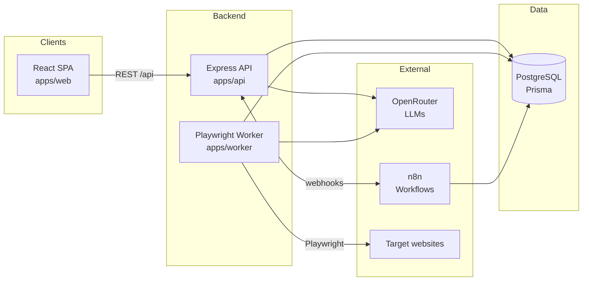

# Architecture

Single source of truth for how OmniStacks AI Engine is put together. If code and this
document disagree, fix one of them in the same PR.

## System overview

OmniStacks AI Engine is an AI-powered lead generation platform: it scrapes and imports
prospects, enriches and scores them with LLMs (via OpenRouter), and automates outreach
through n8n workflows.



## Service responsibilities

| Service        | Location           | Responsibilities                                                                                                                                                                                                                                | Explicitly NOT responsible for                                                                                                                                                           |
| -------------- | ------------------ | ----------------------------------------------------------------------------------------------------------------------------------------------------------------------------------------------------------------------------------------------- | ---------------------------------------------------------------------------------------------------------------------------------------------------------------------------------------- |
| **Web**        | `apps/web`         | UI for campaigns, leads, workflows, settings. All data access through `src/api/client.ts`.                                                                                                                                                      | Talking to the database, OpenRouter, or n8n directly.                                                                                                                                    |
| **API**        | `apps/api`         | REST endpoints, request validation (Zod), authentication/authorization, owning the Prisma schema, enqueueing `ScrapeJob` rows, the website analyzer module (Playwright-driven data collection, see below), synchronous LLM calls, n8n webhooks. | Long-running work needing durable multi-instance queueing (moves to `apps/worker` once M4 exists); AI analysis, scoring, email, or n8n — the website analyzer's explicit scope boundary. |
| **Worker**     | `apps/worker`      | Polling `ScrapeJob` rows, Playwright scraping, batch LLM enrichment/scoring, persisting results, updating job status/attempts.                                                                                                                  | Serving HTTP; defining schema (consumes API's Prisma schema).                                                                                                                            |
| **PostgreSQL** | Compose `postgres` | System of record for application data (`omnistacks` DB) and n8n state (`n8n` DB, created by `docker/postgres/init/01-create-n8n-db.sh`).                                                                                                        | —                                                                                                                                                                                        |
| **n8n**        | Compose `n8n`      | Outreach sequences, CRM syncs, notifications, third-party integrations. Workflow JSON is versioned in `n8n/workflows/` (see [N8N.md](N8N.md)).                                                                                                  | Core data mutations (goes through the API).                                                                                                                                              |

## Data flow

The canonical lead lifecycle:

1. **Campaign created** — user creates a `Campaign` via the API (`DRAFT` → `ACTIVE`).
2. **Job enqueued** — API inserts a `ScrapeJob` (`type=SCRAPE`, `status=PENDING`) with the
   target criteria in `payload`.
3. **Scraping** — worker claims the job (`PENDING` → `RUNNING`), launches Chromium via
   `src/browser.ts`, extracts prospects, and inserts `Lead` rows (`source=SCRAPED`,
   `status=NEW`).
4. **Enrichment** — an `ENRICH` job sends lead context to OpenRouter using the prompts in
   [PROMPTS.md](PROMPTS.md); the validated JSON result is stored in `Lead.enrichment`
   (`status=ENRICHED`).
5. **Scoring** — a `SCORE` job produces `Lead.score` (0–100) and qualification
   (`status=QUALIFIED` / `DISQUALIFIED`).
6. **Outreach** — the API calls an n8n webhook; n8n runs the outreach sequence and reports
   back via API webhooks (`status=CONTACTED` → `CONVERTED`).

Every state transition is persisted in PostgreSQL — the database is the only shared state
between services (no in-memory coordination).

> This numbered list describes the scaffold's original `Campaign`/`Lead` design; those
> models are superseded by `Business` as the operative entity (see
> [DATABASE.md](DATABASE.md) and [ROADMAP.md](ROADMAP.md)). The flow actually implemented
> so far is the website analyzer, below.

### Website analysis flow (implemented, M2)

1. **Business created** — via the lead management API (`status=NEW`).
2. **Analysis started** — `POST /api/businesses/:businessId/website-analyses` validates
   the business has a website, creates a `WebsiteAnalysis` row (`status=PENDING`), and
   returns immediately (`202`). Execution continues in the background, gated by a small
   in-process concurrency limiter (not the durable queue scoped for M4).
3. **Capture** — the analyzer marks the row `RUNNING`, launches Chromium (Playwright,
   in-process within `apps/api` — see the design decision below), navigates to the site
   (tolerating redirects, invalid TLS certs, and bounded timeouts), and extracts a full
   page's worth of structured data plus a full-page screenshot.
4. **Persisted** — all captured fields, the screenshot (saved to local disk, metadata in
   the row), and `durationMs` are written; status becomes `COMPLETED` or, on failure,
   `FAILED` with an `error` message.
5. **Business promoted** — on success, the business transitions `NEW → ANALYZED`
   (idempotent: a no-op if it's already past `NEW`).

Every state transition is persisted in PostgreSQL, same as the pattern above — the
analyzer introduces no new shared-state mechanism.

## Folder structure

```
.
├── apps/
│   ├── api/                  # Express + Prisma REST API
│   │   ├── prisma/           # schema.prisma + migrations (owned here)
│   │   └── src/
│   │       ├── config/       # env parsing/validation (Zod)
│   │       ├── lib/          # prisma client, openrouter client
│   │       ├── middleware/   # error handling, auth (future)
│   │       ├── modules/      # feature modules (business logic goes here)
│   │       │   ├── businesses/        # lead management (M1)
│   │       │   └── website-analyzer/  # Playwright data collection (M2)
│   │       │       └── extract/       # pure classification/extraction helpers
│   │       └── routes/       # route composition (health, ...)
│   ├── web/                  # React + Vite SPA
│   │   └── src/
│   │       ├── api/          # typed fetch client
│   │       ├── components/   # shared UI
│   │       ├── pages/        # feature pages
│   │       └── styles/
│   └── worker/               # Playwright job worker
│       └── src/
│           ├── config/       # env parsing/validation
│           └── jobs/         # job handlers (business logic goes here)
├── docker/                   # Dockerfiles, nginx config, postgres init
├── docs/                     # this documentation
├── n8n/workflows/            # exported n8n workflow JSON (versioned)
├── scripts/                  # setup / dev / db helper scripts
├── .github/workflows/        # CI
└── docker-compose.yml        # postgres, api, web, worker, n8n
```

Feature code lands in `apps/api/src/modules/<feature>/` (routes + services per feature)
and `apps/worker/src/jobs/<job-type>.ts` — see
[CODING_STANDARDS.md](CODING_STANDARDS.md).

## Design decisions

| Decision                                                                                | Rationale                                                                                                                                                                                                                                                                                                                                         |
| --------------------------------------------------------------------------------------- | ------------------------------------------------------------------------------------------------------------------------------------------------------------------------------------------------------------------------------------------------------------------------------------------------------------------------------------------------- |
| **Monorepo with npm workspaces**                                                        | One repo, one lockfile, one CI pipeline; no tooling beyond npm. Apps stay independently buildable/deployable (separate Dockerfiles).                                                                                                                                                                                                              |
| **Separate worker process**                                                             | Scraping and LLM batch work are long-running and crash-prone; isolating them keeps the API responsive and lets workers scale/restart independently.                                                                                                                                                                                               |
| **Job queue in PostgreSQL (`scrape_jobs`)**                                             | At current scale a table + polling is simpler and fully transactional with the data it produces. No extra infra. Revisit at scale (see below).                                                                                                                                                                                                    |
| **Prisma as ORM**                                                                       | Schema-as-code, generated types shared with TypeScript, mature migration tooling (`migrate dev`/`migrate deploy`).                                                                                                                                                                                                                                |
| **OpenRouter instead of direct provider SDKs**                                          | One API for many models; model choice is an env var (`OPENROUTER_MODEL`), so swapping models is config, not code.                                                                                                                                                                                                                                 |
| **Thin hand-rolled OpenRouter client**                                                  | The OpenAI-compatible surface we use is one endpoint; a fetch wrapper avoids an SDK dependency and keeps the request shape explicit.                                                                                                                                                                                                              |
| **n8n for outreach/integrations**                                                       | Non-developers can own outreach sequences; integrations (CRMs, email tools) come for free; workflow JSON is still code-reviewed in `n8n/workflows/`.                                                                                                                                                                                              |
| **n8n gets its own database**                                                           | Keeps n8n's internal tables out of the application schema; both live on the same Postgres instance for operational simplicity.                                                                                                                                                                                                                    |
| **nginx serves the SPA and proxies `/api`**                                             | Same-origin in production (no CORS headaches), immutable asset caching, one public entrypoint for the web tier.                                                                                                                                                                                                                                   |
| **ESM everywhere, strict TS base config**                                               | Single module system across apps; `tsconfig.base.json` enforces strictness uniformly.                                                                                                                                                                                                                                                             |
| **Zod-validated env at startup**                                                        | Misconfiguration fails fast at boot with a precise error instead of surfacing mid-request.                                                                                                                                                                                                                                                        |
| **Migrations applied by the API container**                                             | `docker/api/entrypoint.sh` runs `prisma migrate deploy` on boot — deploys are self-contained; no manual migration step.                                                                                                                                                                                                                           |
| **Website analyzer runs in-process inside `apps/api`, not `apps/worker`**               | The durable job queue (M4) isn't built yet, and this module's job is explicitly scoped to data collection only; adding cross-process dispatch now would be new infrastructure the milestone doesn't need. A small in-process concurrency limiter (not a queue) caps simultaneous Playwright launches. Revisit once M4 exists or load requires it. |
| **`docker/api.Dockerfile` now built on the Playwright base image**                      | Alpine isn't a supported target for Playwright's bundled Chromium; matches `worker.Dockerfile`'s already-established pattern (same pinned version, same non-root `pwuser`) rather than inventing a second approach.                                                                                                                               |
| **Screenshot storage: local disk, path resolved relative to the module's own location** | No object storage service in the stack yet; anchoring to `import.meta.url` rather than `process.cwd()` keeps the path identical across `npm run dev`, tests, and Docker (whose working directories differ) — see [DEPLOYMENT.md](DEPLOYMENT.md) for the migration path to S3-compatible storage.                                                  |
| **Dedicated `WebsiteAnalysisStatus` enum instead of reusing `JobStatus`**               | Same PENDING/RUNNING/COMPLETED/FAILED shape today, but the two state machines belong to independently evolving concerns (see [DATABASE.md](DATABASE.md)) and shouldn't be coupled just because they currently match.                                                                                                                              |

## Future scaling strategy

Ordered by when we expect to need it, cheapest first:

1. **Scale workers horizontally** — the worker is stateless; run N replicas
   (`docker compose up --scale worker=4`). Requires job claiming via
   `UPDATE ... WHERE status = 'PENDING' ... FOR UPDATE SKIP LOCKED` semantics so replicas
   don't double-claim (part of the queue milestone, see [ROADMAP.md](ROADMAP.md)).
2. **Replace polling with a real queue** — if job volume outgrows the Postgres queue
   (~tens of jobs/sec), move to BullMQ + Redis. The `ScrapeJob` table stays as the audit
   record; only dispatch moves.
3. **Split read traffic** — Postgres read replica for dashboard/analytics queries.
4. **API horizontal scaling** — the API is stateless (JWT auth, no sessions); put replicas
   behind the nginx/ingress layer.
5. **Rate limiting & caching** — per-user rate limits at the API; cache LLM responses
   keyed by prompt hash to control OpenRouter spend.
6. **Extract services** — only if team/domain size demands it: enrichment could become its
   own service consuming the same queue. Avoid premature microservices.
7. **Move website analysis onto the durable queue** — once M4's job queue exists, heavy
   or bulk analysis workloads can move from `apps/api`'s in-process concurrency limiter
   onto `apps/worker` (which already has the Playwright runtime and a `browser.ts`
   helper of its own) without changing the `WebsiteAnalysis` schema or API contract.
8. **Move screenshot storage off local disk** — local disk ties screenshots to a single
   API instance; horizontally scaling the API requires either a shared volume or moving
   to S3-compatible object storage, swapped in behind `screenshot-storage.ts`'s existing
   save/read interface.
