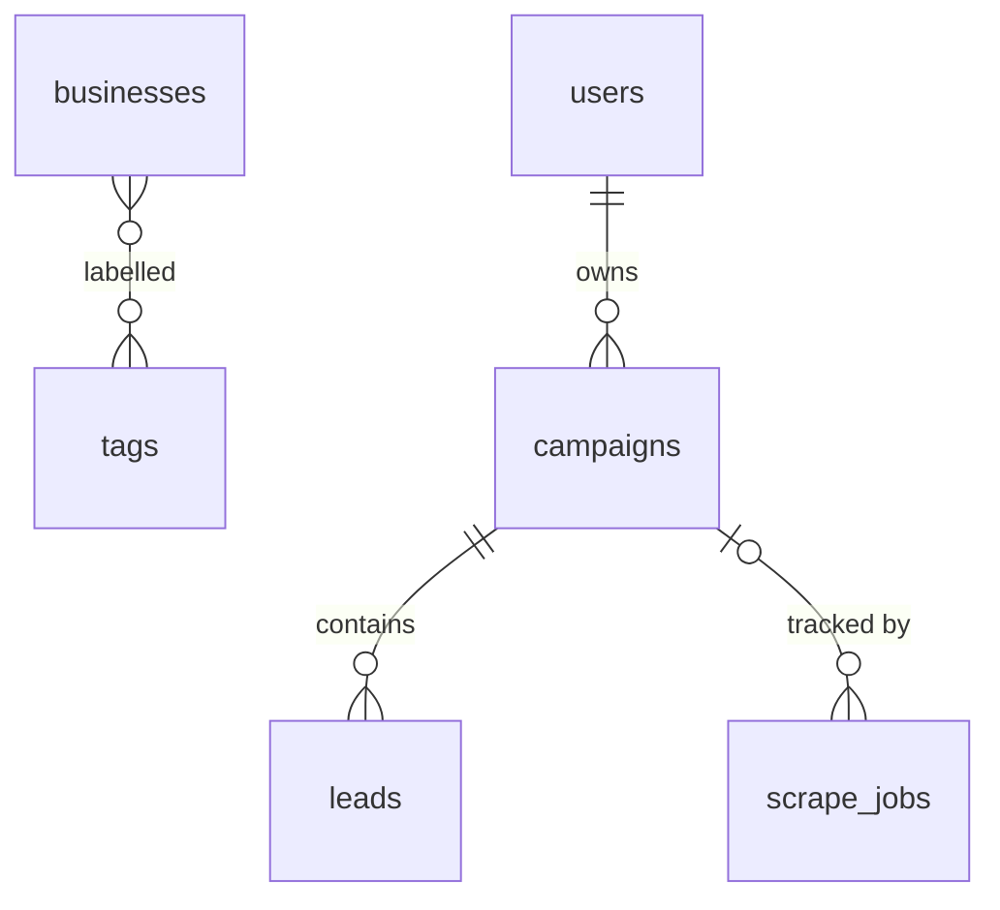

# Database

PostgreSQL 16, accessed exclusively through Prisma. The schema lives in
[`apps/api/prisma/schema.prisma`](../apps/api/prisma/schema.prisma) — that file is the
source of truth; this document explains it. Update both in the same PR.

Two databases run on the same Postgres instance:

| Database     | Purpose                                      | Managed by                                                         |
| ------------ | -------------------------------------------- | ------------------------------------------------------------------ |
| `omnistacks` | Application data (all tables below)          | Prisma migrations                                                  |
| `n8n`        | n8n internal state (credentials, executions) | n8n itself (created by `docker/postgres/init/01-create-n8n-db.sh`) |

## Naming conventions

- **Tables:** plural `snake_case`, mapped with `@@map` (`users`, `campaigns`, `leads`,
  `scrape_jobs`). Prisma model names stay singular PascalCase.
- **Columns:** `camelCase` (Prisma default). No `@map` per column unless integrating with
  external tooling that requires it.
- **Primary keys:** `id String @id @default(cuid())` — collision-free, sortable-ish,
  URL-safe. Never expose auto-increment integers.
- **Timestamps:** every table has `createdAt DateTime @default(now())` and
  `updatedAt DateTime @updatedAt`. Domain timestamps are nullable `...At` fields
  (`startedAt`, `finishedAt`).
- **Enums:** SCREAMING_SNAKE values, singular PascalCase names (`LeadStatus`, `JobType`).
- **Foreign keys:** `<relation>Id` (`ownerId`, `campaignId`).
- **JSON columns:** used only for genuinely schemaless payloads (`payload`, `result`,
  `enrichment`). Anything queried/filtered regularly gets promoted to a real column.

## Tables

### `users`

Platform users.

| Column      | Type       | Notes                         |
| ----------- | ---------- | ----------------------------- |
| `id`        | `String`   | PK, cuid                      |
| `email`     | `String`   | **Unique**                    |
| `name`      | `String?`  |                               |
| `role`      | `UserRole` | `ADMIN` \| `MEMBER` (default) |
| `createdAt` | `DateTime` |                               |
| `updatedAt` | `DateTime` |                               |

Relations: has many `campaigns` (as owner).

> Auth milestone (M2) will add credential columns (e.g. `passwordHash`) via migration.

### `businesses`

A prospect business — the operative entity of the lead management module (M1) and the
row every pipeline stage (analysis, audit, outreach) operates on.

| Column      | Type             | Notes                                              |
| ----------- | ---------------- | -------------------------------------------------- |
| `id`        | `String`         | PK, cuid                                           |
| `name`      | `String`         | Required                                           |
| `website`   | `String?`        | Raw URL exactly as entered/imported                |
| `domain`    | `String?`        | **Unique** — normalized from `website` (see below) |
| `email`     | `String?`        | Validated on write                                 |
| `phone`     | `String?`        |                                                    |
| `industry`  | `String?`        |                                                    |
| `country`   | `String?`        |                                                    |
| `city`      | `String?`        |                                                    |
| `status`    | `BusinessStatus` | Pipeline stage, `NEW` default (full list below)    |
| `notes`     | `String?`        | Free text                                          |
| `createdAt` | `DateTime`       |                                                    |
| `updatedAt` | `DateTime`       |                                                    |

`BusinessStatus` (pipeline order): `NEW` → `ANALYZED` → `AUDITED` → `EMAIL_DRAFTED` →
`EMAIL_SENT` → `RESPONDED` → `MEETING_BOOKED` → `CLIENT`, plus `ARCHIVED` (terminal,
reachable from any stage).

Relations: many-to-many with `tags` (implicit Prisma join table `_BusinessToTag`).
Indexes: `(status)`, `(industry)`, `(country)`, `(name)`, `(email)`, `(createdAt)` —
these back the list view's filters, search, and default sort.

**Domain normalization** (implemented in
`apps/api/src/modules/businesses/domain.ts`): lowercase the hostname, strip protocol,
credentials, port, path/query/fragment, and a leading `www.`; unicode hostnames become
punycode. `https://www.Acme.com/about` → `acme.com`. The unique constraint on the
normalized `domain` is the duplicate-prevention mechanism for both API writes (`409
CONFLICT`) and CSV imports (rows reported as duplicates). Businesses without a website
have `domain = NULL`, which Postgres exempts from uniqueness.

### `tags`

Free-form labels attachable to any business (`hot`, `q3-batch`, ...).

| Column      | Type       | Notes      |
| ----------- | ---------- | ---------- |
| `id`        | `String`   | PK, cuid   |
| `name`      | `String`   | **Unique** |
| `createdAt` | `DateTime` |            |

Relations: many-to-many with `businesses`. Tags are created on demand
(`connectOrCreate`) when referenced by name through the API.

### `campaigns`

A lead generation campaign owned by a user.

| Column        | Type             | Notes                                                   |
| ------------- | ---------------- | ------------------------------------------------------- |
| `id`          | `String`         | PK, cuid                                                |
| `name`        | `String`         |                                                         |
| `description` | `String?`        |                                                         |
| `status`      | `CampaignStatus` | `DRAFT` (default) \| `ACTIVE` \| `PAUSED` \| `ARCHIVED` |
| `ownerId`     | `String`         | FK → `users.id`                                         |
| `createdAt`   | `DateTime`       |                                                         |
| `updatedAt`   | `DateTime`       |                                                         |

Relations: belongs to `owner` (User); has many `leads`, `jobs` (ScrapeJob).
Indexes: `(ownerId)`, `(status)`.

### `leads`

A prospect within a campaign.

| Column        | Type         | Notes                                                                                 |
| ------------- | ------------ | ------------------------------------------------------------------------------------- |
| `id`          | `String`     | PK, cuid                                                                              |
| `email`       | `String?`    | Nullable — scraped leads may lack email until enriched                                |
| `fullName`    | `String?`    |                                                                                       |
| `company`     | `String?`    |                                                                                       |
| `title`       | `String?`    |                                                                                       |
| `website`     | `String?`    |                                                                                       |
| `linkedinUrl` | `String?`    |                                                                                       |
| `phone`       | `String?`    |                                                                                       |
| `source`      | `LeadSource` | `SCRAPED` (default) \| `IMPORTED` \| `API` \| `MANUAL`                                |
| `status`      | `LeadStatus` | `NEW` (default) → `ENRICHED` → `QUALIFIED`/`DISQUALIFIED` → `CONTACTED` → `CONVERTED` |
| `score`       | `Int?`       | 0–100, written by the scoring job (M5)                                                |
| `enrichment`  | `Json?`      | Validated LLM output — schema in [PROMPTS.md](PROMPTS.md)                             |
| `campaignId`  | `String`     | FK → `campaigns.id`, **onDelete: Cascade**                                            |
| `createdAt`   | `DateTime`   |                                                                                       |
| `updatedAt`   | `DateTime`   |                                                                                       |

Indexes: `(campaignId)`, `(status)`, `(email)`.

Cascade rationale: leads have no meaning outside their campaign; deleting a campaign
removes its leads.

### `scrape_jobs`

Background job queue consumed by `apps/worker` (see
[ARCHITECTURE.md](ARCHITECTURE.md) for queue design and its scaling limits).

| Column       | Type        | Notes                                                                      |
| ------------ | ----------- | -------------------------------------------------------------------------- |
| `id`         | `String`    | PK, cuid                                                                   |
| `type`       | `JobType`   | `SCRAPE` \| `ENRICH` \| `SCORE` \| `SYNC`                                  |
| `status`     | `JobStatus` | `PENDING` (default) \| `RUNNING` \| `COMPLETED` \| `FAILED` \| `CANCELLED` |
| `payload`    | `Json?`     | Job input (target URLs, criteria, model params)                            |
| `result`     | `Json?`     | Output persisted by the worker                                             |
| `error`      | `String?`   | Populated on failure                                                       |
| `attempts`   | `Int`       | Default 0; incremented per try (max attempts enforced in M3)               |
| `campaignId` | `String?`   | FK → `campaigns.id`, **onDelete: SetNull**                                 |
| `startedAt`  | `DateTime?` |                                                                            |
| `finishedAt` | `DateTime?` |                                                                            |
| `createdAt`  | `DateTime`  |                                                                            |
| `updatedAt`  | `DateTime`  |                                                                            |

Indexes: `(status, type)` — the worker's poll query; `(campaignId)`.

SetNull rationale: jobs are an audit/operations record; they outlive campaign deletion.

## Relationships (summary)

> `campaigns`/`leads` are scaffold-era models superseded by `businesses` as the
> operative lead entity; their future (repurpose vs. remove) is decided with M7 — see
> [ROADMAP.md](ROADMAP.md).

## Index policy

- Index every foreign key used in lookups (`ownerId`, `campaignId`).
- Index columns that appear in hot `WHERE` clauses (`status`, `email`, `(status, type)`).
- Add new indexes with the query that motivates them in the migration PR description.
- Don't index speculatively — Postgres write amplification is real on `leads` at volume.

## Migration strategy

- **Tooling:** Prisma Migrate. Migrations live in `apps/api/prisma/migrations/` — the
  first one (`20260703091443_init_lead_management`) creates the full schema above.
- **Create (dev):** `./scripts/db-migrate.sh <name>` (wraps `prisma migrate dev`) against
  the local Compose Postgres. Commit the generated SQL with the schema change.
- **Tests:** the Vitest global setup applies migrations to the test database
  (`TEST_DATABASE_URL`, default `omnistacks_test`) before integration tests run — in CI
  this is a `postgres:16` service container.
- **Apply (prod):** automatic — the API container's entrypoint
  (`docker/api/entrypoint.sh`) runs `prisma migrate deploy` before starting the server.
  Deploys are self-contained; there is no manual migration step.
- **Rules:**
  - Never edit a migration that has been merged — write a new one.
  - Migrations must be backward compatible with the previous app version (expand →
    migrate → contract for renames/drops), because old containers may briefly run against
    the new schema during deploys.
  - Destructive migrations (dropping columns/tables) require an explicit note in the PR
    and a verified backup (see [DEPLOYMENT.md](DEPLOYMENT.md)).
  - `prisma migrate reset` (via `./scripts/db-reset.sh`) is local-only. It is destructive
    and prompts for confirmation.
- **Seeding:** a `prisma/seed.ts` will be added with M2 for local fixtures and M7 for
  analytics load testing. Seeds must be idempotent.
